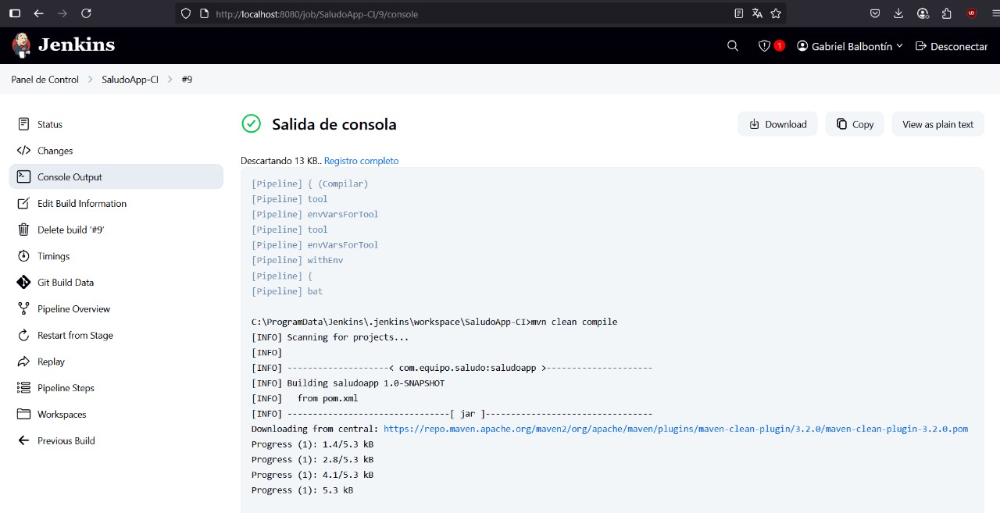
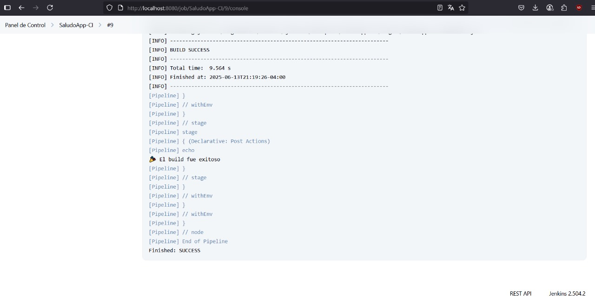

# Grupo N°10 Jenkins y JAVA

*     Ingrid Oñate A https://github.com/ingridoa/saludoapp
*     Victor Diaz https://github.com/vitoDaz/SaludoApp
*     Gabriel Balbontin https://github.com/bagxxi/saludoapp

1. ¿Qué beneficios concretos viste al automatizar la construcción con Jenkins?

Automatizar la construcción con Jenkins permitió: Reducir errores manuales al compilar y probar el proyecto. Detectar problemas rápidamente, ya que cada push activa una construcción y pruebas automáticas. Asegurar consistencia en cada construcción, sin importar quién hizo el cambio. Ahorro de tiempo, al no tener que ejecutar manualmente los comandos de Maven. Facilita la integración continua (CI) en equipos de desarrollo, acelerando la entrega de software.

2. ¿Qué parte del proceso crees que sería más crítica en un equipo grande?

En un equipo grande, la parte más crítica es: La configuración y mantenimiento del pipeline de CI. La correcta integración con GitHub y ramas (usando pull requests y ramas como main, dev, release, etc.). La ejecución de pruebas automatizadas: si fallan, debe notificarse rápidamente a los desarrolladores responsables. La gestión de dependencias y entornos, para evitar errores por inconsistencias locales.

3. ¿Cómo Jenkins asegura calidad antes de hacer despliegues?

Jenkins asegura calidad mediante: Ejecución automática de pruebas unitarias y de integración cada vez que hay un cambio en el repositorio. Notificaciones de fallos inmediatas para que los errores se corrijan rápidamente. Permite incluir herramientas de análisis estático de código (como SonarQube). Evita que código con errores llegue a producción, al bloquear el pipeline si hay fallos. Asegura que el código siempre esté construido y probado en un entorno limpio y controlado.

4. ¿Qué cambiarías en este pipeline para prepararlo para producción?
Para un entorno de producción, mejoraría el pipeline así: Agregar etapas de despliegue automatizado, por ejemplo usando Docker y Kubernetes o servidores remotos. Incluir un paso de análisis de código estático para verificar calidad, estándares y seguridad. Validar código con revisiones de pull request antes de ejecutar el pipeline completo. Separar los pipelines por ramas (main, dev, feature) para manejar flujos de trabajo Git más realistas. Implementar notificaciones por correo o Slack para reportar fallos. Agregar pruebas de performance o carga si es necesario.

Capturas:

